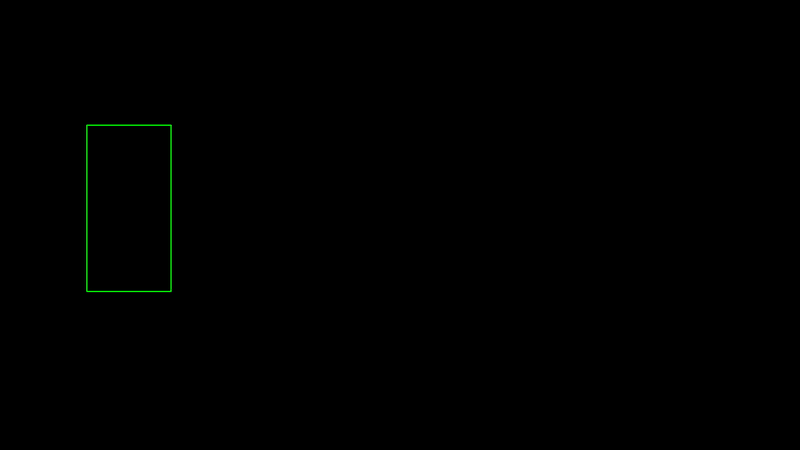
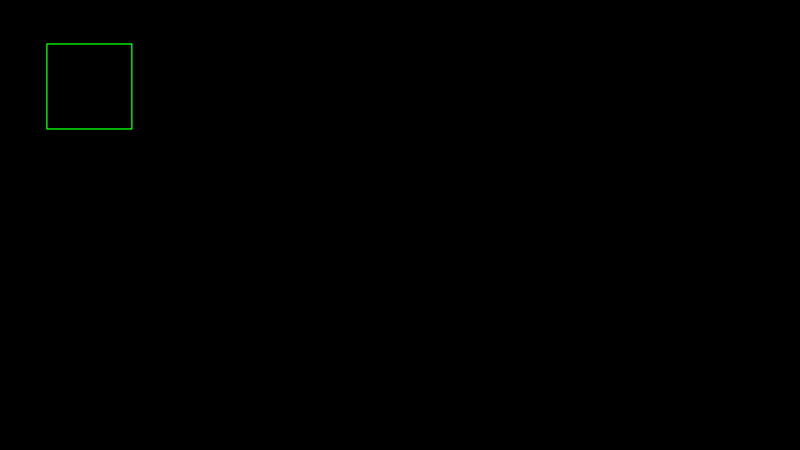

# Real-Time Simulation Utilities

Developing computer vision applications often requires working with real-time camera feeds or RTSP streams, rather than just a set of pre-recorded videos. **Kano** offers tools to:

- Measure pipeline FPS (frames per second).
- Simulate real-time camera streams from videos.
- Generate fake detection results for testing object detection tasks.


## Track FPS of your pipeline with FPSCounter Class

The `FPSCounter` class tracks the number of frames processed over time and computes the FPS. It also provides an option to print FPS at specified intervals and ensure that the FPS does not exceed a target value.

```python
import time

from kano.lab.profiler import FPSCounter

# Initialize FPSCounter with a 1-second print cycle
fps_counter = FPSCounter(fps_print_cycle=1, prefix_fps_print="App")

# Simulate frame processing
for i in range(100):
    fps_counter.update()
    time.sleep(0.01)  # Simulating 100 frames per second (10ms per frame)
```

Result:

```
App FPS: 100
App FPS: 100
App FPS: 100
...
```

---

## Get CPU percent and RAM usage of your python process

The `ResourceProfiler` class monitors the system's CPU and RAM usage for a given process (default is the current process) and logs the data to a CSV file. You can also print the resource usage at specified intervals.

```python
import time

from kano.lab.profiler import ResourceProfiler

# Initialize ResourceProfiler to monitor CPU and RAM usage every 2 seconds
profiler = ResourceProfiler(interval_seconds=2, csv_path="resource_usage.csv")

# Start monitoring and printing data every 2 seconds
while True:
    profiler.update()
    time.sleep(1)
```

Result:

```
PID: 12345 - CPU Usage: 12.3% - total RAM: 200.15 MiB
PID: 12345 - CPU Usage: 14.1% - total RAM: 202.35 MiB
...
```


## Simulate real-time camera streams with `VideoStreamer`

The `VideoStreamer` class streams video from a source (file or camera) and retrieves frames in real-time, ensuring that the current frame is always processed without delay. Unlike `cv2.VideoCapture`, which might introduce a delay while waiting for the next frame in the stream, `VideoStreamer` fetches the frame at the current time, making it ideal for real-time processing.


```python
from kano.lab.source_reader import VideoStreamer


video_streamer = VideoStreamer("video.mp4")
while True:
    frame = video_streamer.get_latest_frame()
    print(frame.shape)  # Process the frame
```


## Generate animated object detection results with `FakeDetect`

The `FakeDetect` class provides a utility to simulate smooth transitions between two bounding boxes over a specified duration. It is particularly useful for testing and visualizing object detection systems, where such transitions can mimic real-world movement or animations.

```python
import time

import cv2
import numpy as np
from kano.lab import FakeDetect, Box
from kano.detect_utils import draw_bbox


fake_detect = FakeDetect(
    begin_box=Box(width=200, height=400, point=[300, 500]),
    end_box=Box(width=400, height=200, point=[1500, 500]),
    duration=4,
)
fake_detect.start(time.time())

canvas = np.zeros((1080, 1920, 3), dtype=np.uint8)

while True:
    canvas[:] = 0
    xyxy = fake_detect.move(time.time())
    if xyxy is not None:
        canvas = draw_bbox(canvas, xyxy, bbox_color=(0, 255, 0))

    cv2.imshow("1920x1080", canvas)

    if cv2.waitKey(1) & 0xFF == ord('q'):
        break

cv2.destroyAllWindows()
```

Result:



## Generate and Control Animated Object Detection Sequences with `DetectGen`

The `DetectGen` module manages and generates a sequence of fake detections for simulation or testing object detection tasks. It allows for smooth transitions between bounding boxes over specified durations and supports looping options such as:

- **NoLoop**: Plays once and stops.
- **Reversed**: Reverses the sequence after completion.
- **Replay**: Repeats the sequence from the beginning.

```python
import time

import cv2
import numpy as np
from kano.lab import Box, LoopType, DetectGen
from kano.detect_utils import draw_bbox

detect_gen = DetectGen(
    boxes=[
        Box(200, 200, [200, 200]),
        Box(400, 400, [960, 600]),
        Box(200, 200, [1720, 200]),
    ],
    durations=[2, 1],
    loop_type=LoopType.Reversed,
)
detect_gen.start(time.time())
canvas = np.zeros((1080, 1920, 3), dtype=np.uint8)
while True:
    canvas[:] = 0
    xyxy = detect_gen.gen_xyxy(time.time())

    if xyxy is not None:
        canvas = draw_bbox(canvas, xyxy, bbox_color=(0, 255, 0))

    cv2.imshow("1920x1080", canvas)

    if cv2.waitKey(1) & 0xFF == ord('q'):
        break

cv2.destroyAllWindows()
```

Result:


